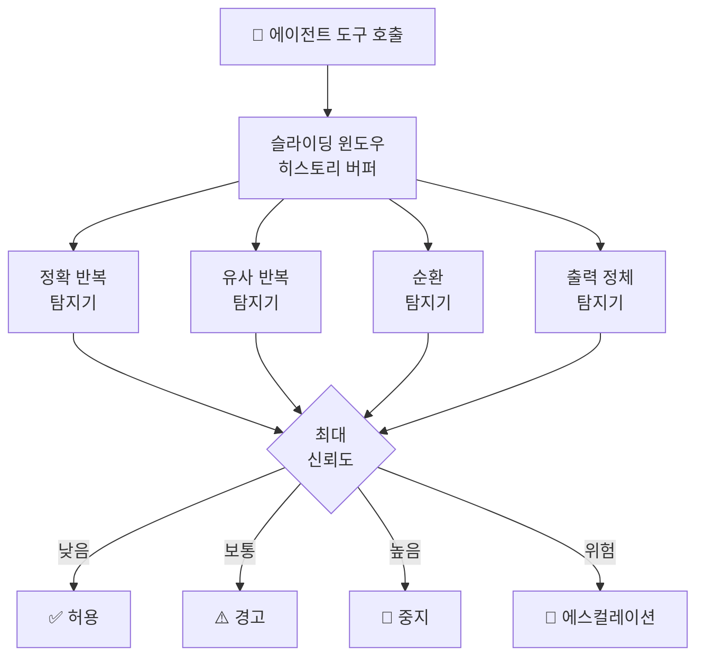

# agent-loop-guard

> [English](README.md)

프레임워크 무관 에이전트 루프 탐지 — 슬라이딩 윈도우 유사도 점수로 멈춘 에이전트를 감지합니다.

## 설치

```bash
pip install agent-loop-guard
```

## 빠른 시작

```python
from loop_guard import LoopGuard, Action

guard = LoopGuard()

for action in agent_actions:
    decision = guard.check(tool=action.name, args=action.args)
    if decision.action == Action.STOP:
        print(f"루프 감지: {decision.reason}")
        break
```

## 왜 `max_iter`로는 부족한가?

| 접근법 | 감지 대상 | 한계 |
|--------|----------|------|
| `max_iter=10` | 무한 실행 에이전트 | 긴 *정상* 작업도 종료시킴; 9단계째 3-스텝 루프를 놓침 |
| **agent-loop-guard** | 정확 반복, 유사 반복, A→B→C→A 순환, 출력 정체 | — |

`max_iter`는 단순 타임아웃입니다. `agent-loop-guard`는 *행동 패턴*을 감지합니다 — 약간의 변형이 있어도 같은 작업을 반복하는 에이전트를 잡아냅니다.

## 탐지 전략

| 전략 | 감지 대상 | 신뢰도 시그널 |
|------|----------|-------------|
| **정확 반복** | 동일한 `(tool, args)` 연속 호출 | 연속 동일 호출 횟수 |
| **유사 반복** | 거의 동일한 인자 (Jaccard + 편집 거리) | 유사도 > 임계값 |
| **순환 탐지** | A→B→C→A→B→C 반복 시퀀스 | 패턴 반복 횟수 |
| **출력 정체** | 도구가 같은 결과를 반복 반환 | 출력 유사도 > 임계값 |

네 가지 전략이 매 호출마다 동시에 실행됩니다. 가장 높은 신뢰도가 최종 판정을 결정합니다.



## API

```python
guard = LoopGuard(
    window_size=10,             # 메모리에 보관할 액션 수
    similarity_threshold=0.85,  # 유사 매치 임계값
)

decision = guard.check(
    tool="web_search",          # 도구/함수 이름
    args={"query": "python"},   # 인자 (dict 또는 str)
    output="Results: ...",      # 선택: 출력 정체 탐지 활성화
)

decision.action       # Action.CONTINUE | WARN | STOP | ESCALATE
decision.reason       # "Cycle detected: [search → parse → search] repeated 3 times"
decision.strategy     # "cycle_detection"
decision.confidence   # 0.0 ~ 1.0
decision.is_loop      # STOP 또는 ESCALATE이면 True
decision.should_warn  # WARN이면 True

guard.reset()         # 다음 세션에 재사용
```

## 액션 에스컬레이션

연속 탐지 횟수에 따라 액션이 단계적으로 상승합니다:

```python
from loop_guard import ActionConfig

config = ActionConfig(
    warn_threshold=2,      # 2회 연속 → WARN
    stop_threshold=4,      # 4회 연속 → STOP
    escalate_threshold=6,  # 6회 연속 → ESCALATE
)

guard = LoopGuard(action_config=config)
```

## 제네릭 콜백

```python
from loop_guard.integrations.generic import LoopGuardCallback

callback = LoopGuardCallback(
    on_warn=lambda d: logger.warning(f"루프 경고: {d.reason}"),
    on_stop=lambda d: raise_stop_error(d),
)

# 에이전트 루프 내에서:
decision = callback.before_tool_call("search", {"query": "test"})
```

## 라이선스

MIT
